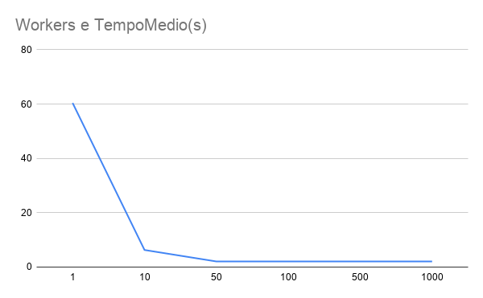

# Análise de Desempenho: Quantidade de Workers

## Metodologia
O experimento teve como objetivo verificar como a quantidade de workers (Goroutines) influencia o tempo de execução do scanner de portas. 

Os testes foram realizados mantendo as mesmas condições em todas as execuções:
* **Alvo:** scanme.nmap.org
* **Execuções:** Cada configuração de workers (1, 10, 50, 100, 500 e 1000) foi executada 3 vezes.
* O tempo final de cada configuração é a média aritmética das 3 execuções.

## Resultados Obtidos
Os dados brutos coletados estão disponíveis no arquivo `analise_workers.csv`. Abaixo, o gráfico ilustra o tempo médio de resposta em relação à quantidade de workers instanciados:

## Conclusão e Comportamento Observado
A análise dos dados revela dois comportamentos distintos no uso de concorrência para varredura de portas:

1. **Ganho Massivo Inicial:** O aumento de 1 para 10 workers reduziu o tempo de execução em aproximadamente 90% (de 60,40s para 6,28s).
2. **Ponto de Saturação:** A partir de 50 workers, o tempo de execução estabilizou em torno de 2,05 segundos. Adicionar 100, 500 ou 1000 workers não trouxe nenhum ganho significativo de desempenho. 

Esse comportamento indica que o gargalo do sistema deixou de ser o processamento local (gerenciamento das Goroutines) e passou a ser o limite da infraestrutura de rede, como a capacidade do sistema operacional de abrir sockets TCP simultâneos ou a latência da conexão com a internet.